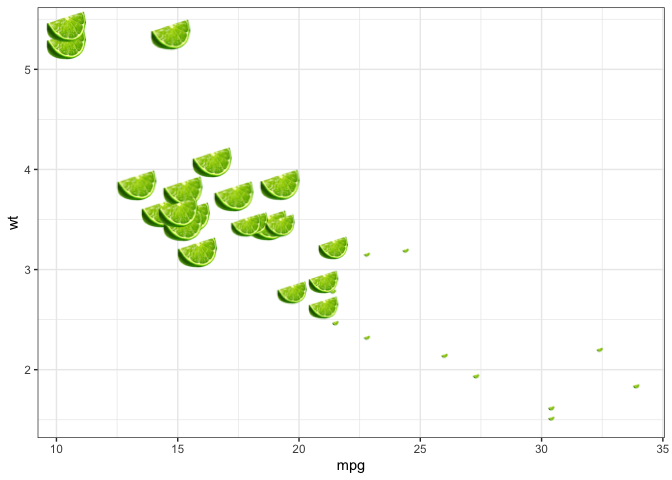

<!-- README.md is generated from README.Rmd. Please edit that file -->

# geomlime 

<!-- badges: start -->

 [](https://www.tidyverse.org/lifecycle/#questioning)
<!-- badges: end -->

`geomlime` provides a bloody `geom_lime()` function for ggplot because
of all the zarking times I frakking type `geom_lime()` instead of
`geom_line()`

## Installation

You can install from
[GitHub](https://github.com/coolbutuseless/geomlime) with:

``` r
# install.package('remotes')
remotes::install_github('coolbutuseless/geomlime')
```

## Example Usage

``` r
library(ggplot2)
library(geomlime)

ggplot(mtcars) +
  geom_lime(aes(mpg, wt, size = cyl)) + 
  theme_bw() + 
  theme(legend.position = 'none')
```



## Acknowledgements

  - R Core for developing and maintaining the language.
  - CRAN maintainers, for patiently shepherding packages onto CRAN and
    maintaining the repository
