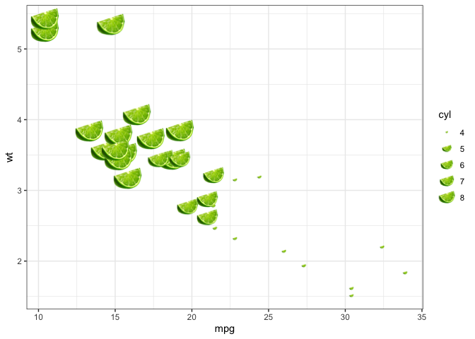

<!-- README.md is generated from README.Rmd. Please edit that file -->

# geomlime 

<!-- badges: start -->

 [](https://www.tidyverse.org/lifecycle/#questioning)
<!-- badges: end -->

`geomlime` provides a bloody `geom_lime()` function for ggplot because
of all the zarking times I frakking type `geom_lime()` instead of
`geom_line()`

## What’s in the box:

  - `geom_lime()` for drawing limes
  - `geom_pint()` for drawing pints

## Installation

You can install from
[GitHub](https://github.com/coolbutuseless/geomlime) with:

``` r
# install.package('remotes')
remotes::install_github('coolbutuseless/geomlime')
```

## Example Usage: `geom_lime()`

``` r
library(ggplot2)
library(geomlime)

ggplot(mtcars) +
  geom_lime(aes(mpg, wt, size = cyl)) + 
  theme_bw()
```



## Example Usage: `geom_pint()`

``` r
ggplot(mtcars) +
  geom_pint(aes(mpg, wt, size = cyl)) + 
  theme_bw()
```


## Similar Software

  - [Michael Barrowman’s](https://twitter.com/MyKo101AB)
    [typos](https://github.com/MyKo101/typos/) package for a great way
    of automatically handling typos in R
  - [ggimage](https://cran.r-project.org/web/packages/ggimage/index.html)
    on CRAN for when you really do want to put images in a ggplot

## Acknowledgements

  - R Core for developing and maintaining the language.
  - CRAN maintainers, for patiently shepherding packages onto CRAN and
    maintaining the repository
